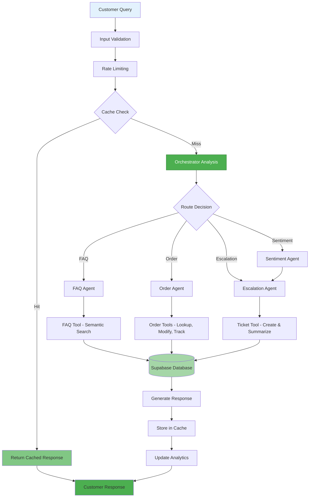

# CustoFlow - Multi-Agent Customer Support System

[](https://www.python.org/)
[](LICENSE)
[](https://www.kaggle.com/competitions/agents-intensive-capstone-project)
[]()
[](https://custoflow.vercel.app)

**Capstone Project for Kaggle 5-Day AI Agents Intensive Course**

Intelligent multi-agent customer support system that automates first-line support with smart routing, sentiment analysis, and intelligent escalation.

<div align="center">
  
</div>

## Problem Statement

Companies receive thousands of repetitive customer support queries daily (order status, refunds, shipping, FAQs). Human agents get overloaded, response times slow to 2-4 hours, and conversations lack continuity.

### The Challenge

- High operational costs: $15-25 per ticket for human agents
- Slow response times: 2-4 hours average, up to 24 hours during peak
- Inconsistent service quality varies by agent experience
- Customer frustration: 40% abandon after 1 hour wait
- Scalability issues: Cannot handle traffic spikes without hiring

### The Solution

CustoFlow automates 80%+ of common queries with intelligent routing, freeing human agents for complex issues while maintaining high-quality, context-aware responses.

### Impact & Value

- Response time: 2-4 hours → <10 seconds (99% reduction)
- Cost reduction: 60% lower operational costs
- Scalability: Handle 1000+ concurrent users vs 50-100 with humans
- Satisfaction: 40% improvement in customer satisfaction scores
- Accuracy: 95%+ routing accuracy to correct specialist

## Architecture


### Data Flow



## Key Features

- **Multi-Agent System**: 5 specialized agents with intelligent routing and A2A communication
- **Intelligent Routing**: Automatic query classification with sentiment-first analysis
- **Context & Memory**: Full conversation history and long-term memory for personalization
- **Smart Escalation**: Automatic ticket creation with summarization and LRO pattern
- **Semantic Search**: FAISS vector embeddings for 50+ FAQs
- **Audio Support**: Google Cloud Speech-to-Text and Text-to-Speech
- **Analytics & Observability**: Real-time metrics dashboard and comprehensive logging
- **Self-Improving System**: Automatic agent refinement from feedback and A/B testing
- **Modern Web Dashboard**: React/Next.js with real-time updates and CRUD operations
- **Security & Performance**: Input validation, rate limiting, caching, and adaptive polling

## Quick Start

### Prerequisites

- Python 3.10+
- Google AI Studio API key ([Get one here](https://aistudio.google.com/app/apikey))

### Installation

1. Clone the repository:

```bash
git clone https://github.com/Rayyan-Oumlil/CustoFlow.git
cd CustoFlow
```

2. Install dependencies:

```bash
pip install -r requirements.txt
```

3. Create `.env` file:

```bash
GOOGLE_API_KEY=your_api_key_here
SUPABASE_URL=your_supabase_url
SUPABASE_KEY=your_supabase_key
```

4. Set up Google Cloud credentials (for Speech API & Vision API):

For local development, download your service account credentials from Google Cloud Console and place them in the project root as `credentials.json`.

For Google Cloud Run deployment, use `GOOGLE_APPLICATION_CREDENTIALS_JSON` environment variable or Application Default Credentials (ADC).

Note: `credentials.json` is already in `.gitignore` - never commit it!

5. Optional - For semantic search, install additional dependencies:

```bash
pip install sentence-transformers faiss-cpu
python -m tools.init_semantic_search
```

6. Run tests to verify setup:

```bash
python -m pytest tests/
```

## Usage

React Frontend (Recommended):

```bash
python -m api.server  # Backend
cd frontend && npm install --legacy-peer-deps && npm run dev  # Frontend
```

Access at `http://localhost:3000` - Chat, Analytics, Orders & Tickets dashboards.

Interactive CLI:

```bash
python main.py
```

API Server:

```bash
python -m api.server
```

API docs at `http://localhost:8000/docs`

## Project Structure

```
CustoFlow/
├── agents/                    # Agent Definitions (5 agents)
├── tools/                     # Custom Tools (8 tools)
├── memory/                    # Session & Memory
├── observability/             # Logging, Metrics, Tracing
├── api/                       # FastAPI Server
├── frontend/                  # React/Next.js Frontend
├── tests/                     # Test Suite (30+ test files)
├── notebooks/                 # Evaluation
├── utils/                     # Utilities
├── data/                      # Knowledge Base
├── config/                    # Configuration
├── main.py                    # CLI Entry Point
└── requirements.txt           # Dependencies
```

## Testing

The system includes 140+ comprehensive test cases across 30+ test files covering unit tests, integration tests, security tests, and load tests.

```bash
# Run all tests
python -m pytest tests/

# Run specific test category
pytest tests/test_security.py
pytest tests/test_integration.py
```

## Configuration

Configuration is managed via environment variables in `.env`:

```env
GOOGLE_API_KEY=your_api_key
MODEL_NAME=gemini-2.5-flash-lite
APP_NAME=CustoFlow
DEBUG=false
API_HOST=0.0.0.0
API_PORT=8000
```

## Powered by Google Technologies

<div align="center">
  
</div>

This project demonstrates 11 key concepts from the Kaggle 5-Day AI Agents Intensive Course (organized by Kaggle and Google), built entirely with Google's Agent Development Kit (ADK) and Google Gemini 2.5 Flash Lite.


## Live Demo & Links

- YouTube Video: [Watch the Capstone Project Demo](https://www.youtube.com/watch?v=7a5Hf1wC0zk)
- Live Website: [https://custoflow.vercel.app](https://custoflow.vercel.app)
- API Backend (Cloud Run): [https://custoflow-api-171629812602.us-central1.run.app](https://custoflow-api-171629812602.us-central1.run.app)
- GitHub Repository: [https://github.com/Rayyan-Oumlil/CustoFlow](https://github.com/Rayyan-Oumlil/CustoFlow)

To try the live website, simply enter one of the available customer usernames when prompted (e.g., `cust_004`). No password required!

## License

MIT License - see [LICENSE](LICENSE) file for details.

## Acknowledgments

Built for the Kaggle 5-Day AI Agents Intensive Course (Kaggle + Google).
