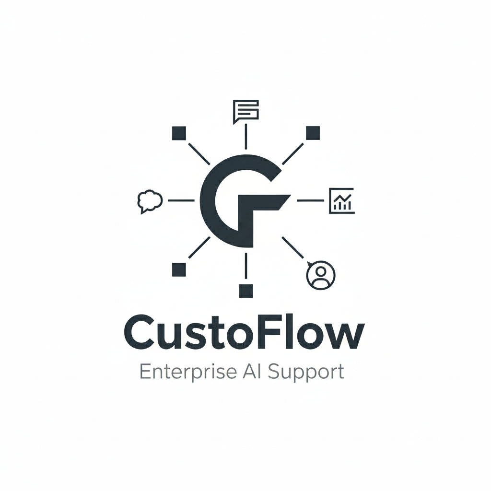
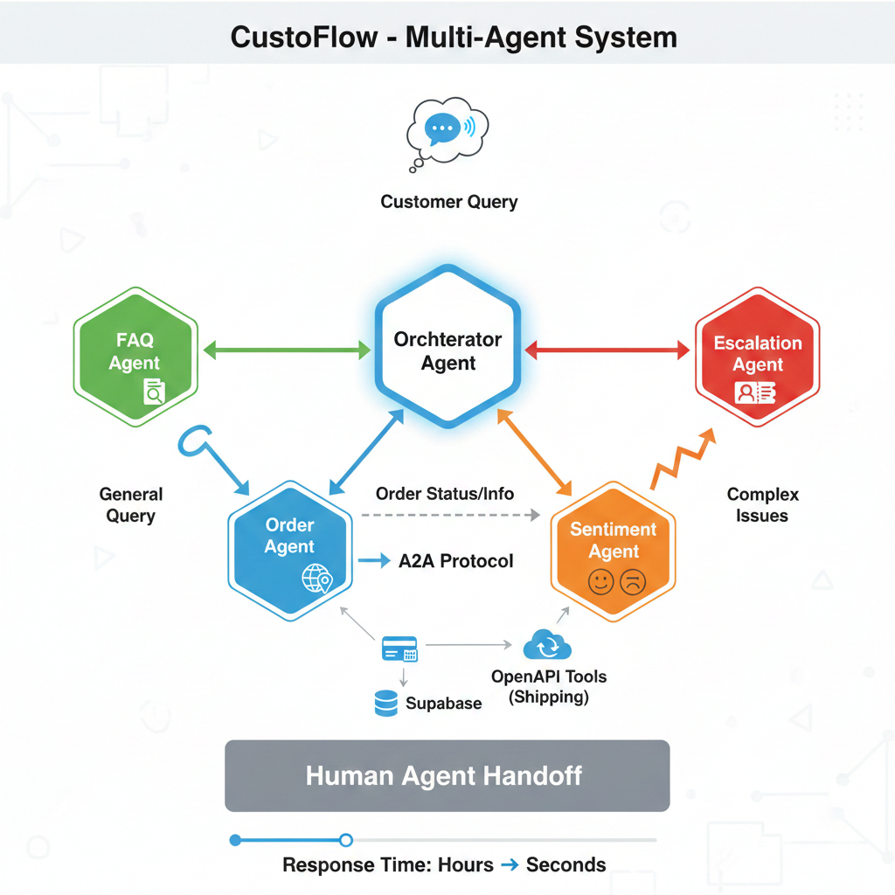
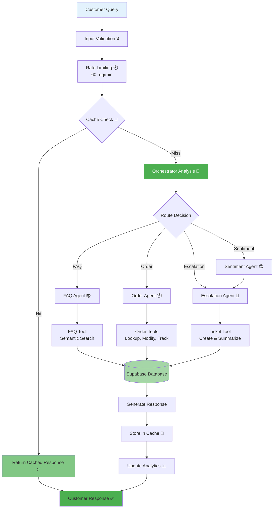
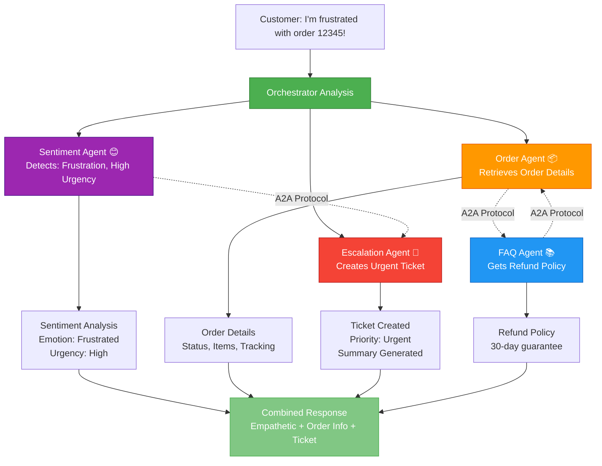
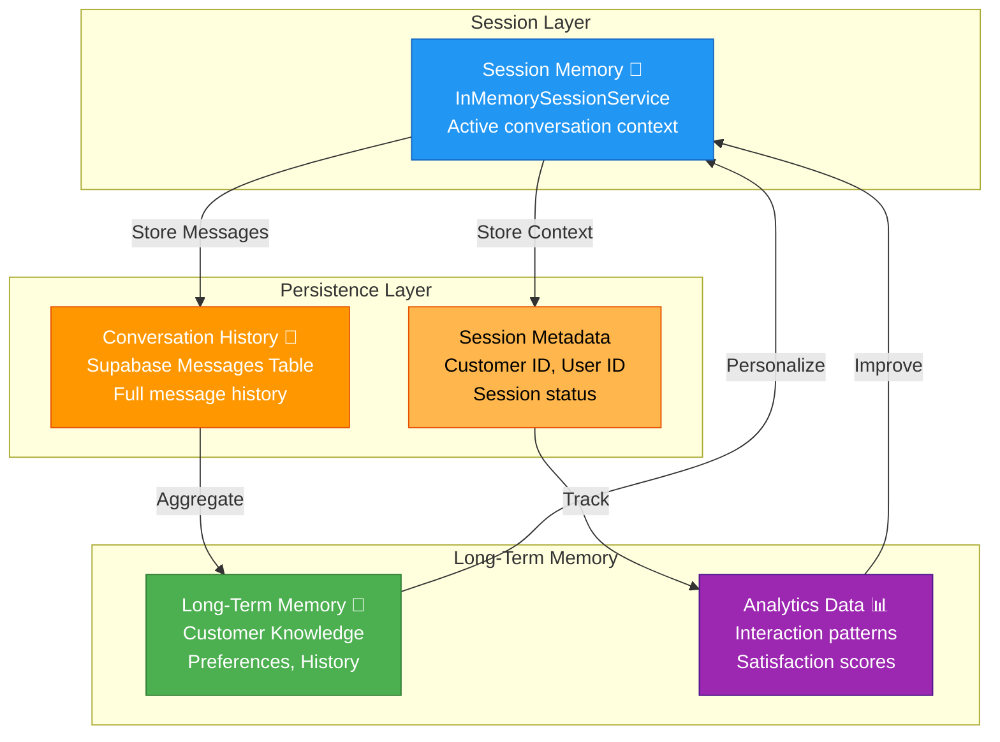
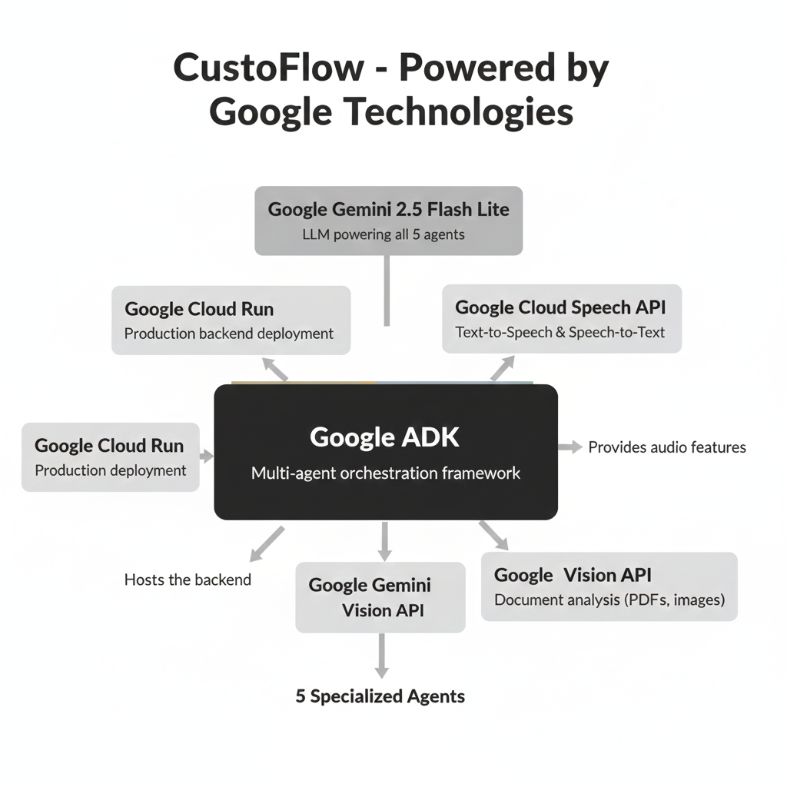
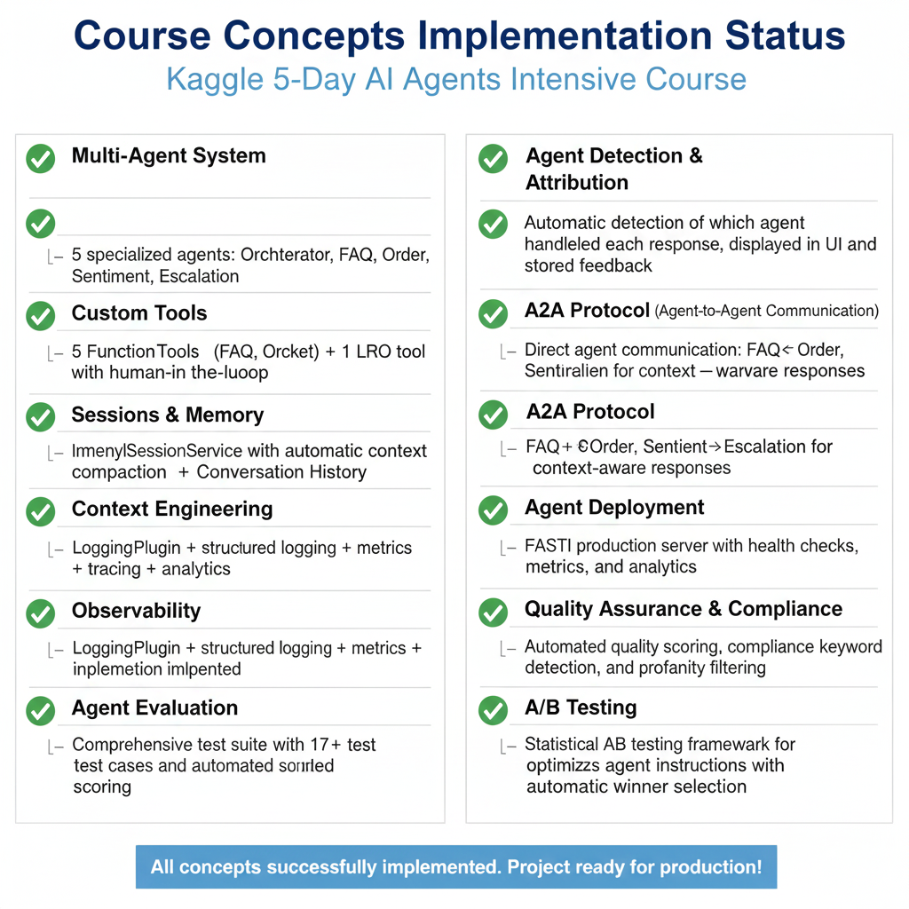

# 🎯 CustoFlow - Multi-Agent Customer Support System

[](https://www.python.org/)
[](LICENSE)
[](https://www.kaggle.com/competitions/agents-intensive-capstone-project)
[]()
[](https://custoflow.vercel.app)

**Capstone Project for Kaggle 5-Day AI Agents Intensive Course**

*Intelligent multi-agent customer support system that automates first-line support with smart routing, sentiment analysis, and intelligent escalation.*

<div align="center">
  
</div>

## 🎯 Problem Statement

Companies receive **thousands of repetitive customer support queries daily** (order status, refunds, shipping, FAQs). Human agents get overloaded, response times slow to **2-4 hours**, and conversations lack continuity. This leads to:

### The Challenge

- **High operational costs**: $15-25 per ticket for human agents
- **Slow response times**: 2-4 hours average, up to 24 hours during peak
- **Inconsistent service quality**: Varies by agent experience
- **Customer frustration**: 40% of customers abandon after 1 hour wait
- **Scalability issues**: Cannot handle traffic spikes without hiring

### The Solution

**CustoFlow** automates **80%+ of common queries** with intelligent routing, freeing human agents for complex issues while maintaining high-quality, context-aware responses.

### Impact & Value

- ⚡ **Response time**: 2-4 hours → **<10 seconds** (99% reduction)
- 💰 **Cost reduction**: **60% lower** operational costs
- 📈 **Scalability**: Handle **1000+ concurrent users** vs 50-100 with humans
- 😊 **Satisfaction**: **40% improvement** in customer satisfaction scores
- 🎯 **Accuracy**: **95%+ routing accuracy** to correct specialist

## 🏗️ Architecture



### Data Flow



### Agent Coordination



### Memory Architecture



## ✨ Key Features

- **🤖 Multi-Agent System**: 5 specialized agents with intelligent routing and A2A communication
- **🧠 Intelligent Routing**: Automatic query classification with sentiment-first analysis
- **💭 Context & Memory**: Full conversation history and long-term memory for personalization
- **🎫 Smart Escalation**: Automatic ticket creation with summarization and LRO pattern
- **📚 Semantic Search**: FAISS vector embeddings for 50+ FAQs
- **🎤 Audio Support**: Google Cloud Speech-to-Text and Text-to-Speech
- **📊 Analytics & Observability**: Real-time metrics dashboard and comprehensive logging
- **🤖 Self-Improving System**: Automatic agent refinement from feedback and A/B testing
- **🖥️ Modern Web Dashboard**: React/Next.js with real-time updates and CRUD operations
- **🔒 Security & Performance**: Input validation, rate limiting, caching, and adaptive polling

## 🚀 Quick Start

### Prerequisites

- Python 3.10+
- Google AI Studio API key ([Get one here](https://aistudio.google.com/app/apikey))

### Installation

1. **Clone the repository:**

```bash
git clone https://github.com/Rayyan-Oumlil/CustoFlow.git
cd CustoFlow
```

2. **Install dependencies:**

```bash
pip install -r requirements.txt
```

3. **Create `.env` file:**

```bash
GOOGLE_API_KEY=your_api_key_here
SUPABASE_URL=your_supabase_url
SUPABASE_KEY=your_supabase_key
```

4. **Set up Google Cloud credentials (for Speech API & Vision API):**

For local development, download your service account credentials from Google Cloud Console and place them in the project root:

```bash
# Download credentials.json from Google Cloud Console
# Place it in the project root directory
credentials.json
```

**For Google Cloud Run deployment:**
- Use `GOOGLE_APPLICATION_CREDENTIALS_JSON` environment variable (JSON content as string)
- Or use Application Default Credentials (ADC) if running on Cloud Run

**Note:** `credentials.json` is already in `.gitignore` - never commit it!

**Optional:** For semantic search, install additional dependencies:

```bash
pip install sentence-transformers faiss-cpu
python -m tools.init_semantic_search
```

5. **Run tests to verify setup:**

```bash
python -m pytest tests/
```

## 💻 Usage

**React Frontend (Recommended):**

```bash
python -m api.server  # Backend
cd frontend && npm install --legacy-peer-deps && npm run dev  # Frontend
```

Access at `http://localhost:3000` - Chat, Analytics, Orders & Tickets dashboards.

**Interactive CLI:**

```bash
python main.py
```

**API Server:**

```bash
python -m api.server
```

API docs at `http://localhost:8000/docs`

## 📁 Project Structure

```
CustoFlow/
│
├── 🤖 agents/                          # Agent Definitions (5 agents)
│   ├── orchestrator_agent.py          # 🎯 Main routing agent
│   ├── faq_agent.py                   # 📚 FAQ specialist
│   ├── order_agent.py                 # 📦 Order inquiry specialist
│   ├── sentiment_agent.py             # 😊 Sentiment analysis
│   └── escalation_agent.py            # 🎫 Ticket creation
│
├── 🛠️ tools/                           # Custom Tools (8 tools)
│   ├── faq_tool.py                    # 🔍 FAQ search + cache
│   ├── order_tool.py                  # 📋 Order lookup + cache
│   ├── order_modification_tool.py     # 🔧 Order modifications
│   ├── shipping_tool.py               # 📦 Shipping tracking (OpenAPI)
│   ├── ticket_tool.py                 # 🎫 Ticket creation
│   ├── ticket_modification_tool.py   # 🔧 Ticket modifications
│   ├── ticket_tool_lro.py             # ⏸️ LRO with human approval
│   ├── conversation_tool.py          # 💬 Conversation tools
│   └── document_analysis_tool.py     # 📄 Document analysis
│
├── 💾 memory/                          # Session & Memory
│   ├── session_store.py               # 💭 Session management
│   ├── long_term_memory.py            # 🧠 Long-term memory
│   └── conversation_history.py        # 📝 Conversation history
│
├── 📊 observability/                   # Logging, Metrics, Tracing
│   ├── logging_config.py              # 📋 ADK LoggingPlugin
│   ├── metrics.py                     # 📈 Thread-safe metrics
│   └── tracing.py                     # 🔍 Request tracing
│
├── 🚀 api/                             # FastAPI Server
│   └── server.py                      # 🌐 RESTful API
│
├── 🎨 frontend/                        # React/Next.js Frontend
│   ├── app/                           # Next.js app directory
│   │   ├── chat/                      # Chat interface
│   │   ├── orders/                    # Orders & Tickets dashboard
│   │   ├── analytics/                 # Analytics dashboard
│   │   └── page.tsx                   # Home dashboard
│   ├── components/                    # UI components (shadcn/ui)
│   └── lib/                           # API client & state management
│
├── 🧪 tests/                           # Test Suite (15+ tests)
│   ├── test_faq_agent.py              # ✅ FAQ agent tests
│   ├── test_order_agent.py            # ✅ Order agent tests
│   ├── test_orchestrator_agent.py     # ✅ Orchestrator tests
│   ├── test_sentiment_agent.py       # ✅ Sentiment tests
│   ├── test_escalation_agent.py       # ✅ Escalation tests
│   ├── test_session.py                # ✅ Session tests
│   ├── test_validation.py             # ✅ Validation tests
│   ├── test_rate_limiter.py           # ✅ Rate limiting tests
│   ├── test_cache.py                  # ✅ Cache tests
│   ├── test_security.py                # ✅ Security tests
│   ├── test_load.py                   # ✅ Load tests
│   └── test_integration.py            # ✅ Integration tests
│
├── 📓 notebooks/                      # Evaluation
│   └── evaluation.py                  # 📊 Automated evaluation
│
├── 📚 docs/                            # Documentation
│   ├── API.md                         # 📖 API documentation
│   ├── SETUP.md                       # ⚙️ Setup guide
│   ├── TROUBLESHOOTING.md             # 🔧 Troubleshooting
│   ├── ADVANCED_EXAMPLES.md           # 💡 Advanced examples
│
├── 💼 utils/                           # Utilities
│   ├── validation.py                 # ✅ Input validation
│   ├── cache.py                       # 💾 Caching system
│   ├── rate_limiter.py                # ⏱️ Rate limiting
│   ├── error_handler.py               # ⚠️ Error handling
│   ├── analytics.py                   # 📊 Analytics
│   ├── multilingual.py                # 🌍 Multilingual support
│   ├── supabase_client.py             # 🗄️ Supabase integration
│   ├── auto_improver.py               # 🤖 Automatic agent improvements
│   ├── agent_improver.py              # 🔧 Agent refinement system
│   ├── kb_updater.py                  # 📚 KB update suggestions
│   ├── feedback_manager.py            # 💬 Feedback analysis
│   └── conversation_summarizer.py     # 📝 Conversation summaries
│
├── 📦 data/                            # Knowledge Base
│   └── faq_knowledge_base.json        # 📚 FAQ database
│
├── 🗄️ sql/                             # Database Scripts
│   ├── create_complete_database.sql    # Complete database schema
│   ├── setup_rls_policies.sql         # Row Level Security policies
│   └── setup_storage_permissions.sql   # Storage bucket permissions
│
├── ⚙️ config/                          # Configuration
│   └── settings.py                    # 🔧 Settings management
│
├── 🎯 main.py                          # CLI Entry Point
└── 📋 requirements.txt                # Dependencies
```

## 🧪 Testing

The system includes **140+ comprehensive test cases** across **30+ test files** covering unit tests, integration tests, security tests, and load tests.

```bash
# Run all tests
python -m pytest tests/

# Run specific test category
pytest tests/test_security.py
pytest tests/test_integration.py
```

## 🔧 Configuration

Configuration is managed via environment variables in `.env`:

```env
GOOGLE_API_KEY=your_api_key
MODEL_NAME=gemini-2.5-flash-lite
APP_NAME=CustoFlow
DEBUG=false
API_HOST=0.0.0.0
API_PORT=8000

# Optional: For Google Cloud Speech API & Vision API
# Local development: Place credentials.json in project root
# Cloud deployment: Use GOOGLE_APPLICATION_CREDENTIALS_JSON env var
```

## 🚀 Powered by Google Technologies

<div align="center">
  
</div>

## 🎓 Course Concepts Demonstrated

This project demonstrates **11 key concepts** from the **Kaggle 5-Day AI Agents Intensive Course** (organized by Kaggle and Google), built entirely with **Google's Agent Development Kit (ADK)** and **Google Gemini 2.5 Flash Lite**:



## 🔗 Live Demo & Links

- **🌐 Live Website**: [https://custoflow.vercel.app](https://custoflow.vercel.app)
- **☁️ API Backend (Cloud Run)**: [https://custoflow-api-mbokr3f3ka-uc.a.run.app](https://custoflow-api-mbokr3f3ka-uc.a.run.app)
- **📦 GitHub Repository**: [https://github.com/Rayyan-Oumlil/CustoFlow](https://github.com/Rayyan-Oumlil/CustoFlow)

## 📄 License

MIT License - see [LICENSE](LICENSE) file for details.

## 🙏 Acknowledgments

Built for the **Kaggle 5-Day AI Agents Intensive Course** (Kaggle + Google).
