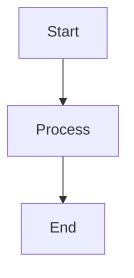

# Diagram Generation Guide

This guide explains how to generate visual diagrams for CustoFlow.

## Prerequisites

1. **Install Python package:**
```bash
pip install graphviz
```

2. **Install Graphviz system package:**

   **Windows:**
   ```bash
   choco install graphviz
   # OR download from: https://graphviz.org/download/
   ```

   **Mac:**
   ```bash
   brew install graphviz
   ```

   **Linux:**
   ```bash
   sudo apt-get install graphviz
   ```

## Generate Diagrams

Run the diagram generation script:

```bash
python scripts/generate_diagrams.py
```

This will create PNG images in `docs/images/`:
- `architecture.png` - Main system architecture
- `data_flow.png` - Request data flow
- `agent_coordination.png` - Multi-agent coordination
- `memory_architecture.png` - Memory system architecture

## Alternative: Mermaid Diagrams

The README also includes Mermaid diagrams that render automatically on GitHub:



These don't require any installation and work directly on GitHub!

## Manual Creation

If you prefer to create diagrams manually:

1. Use tools like:
   - [Draw.io](https://app.diagrams.net/) (free, online)
   - [Lucidchart](https://www.lucidchart.com/) (free tier available)
   - [Excalidraw](https://excalidraw.com/) (free, hand-drawn style)

2. Export as PNG and save to `docs/images/`

3. Reference in README:
```markdown

```

